# Quota user guide

Quota shows how much of each AI subscription you have left: every 5-hour, weekly, monthly
and model-specific allowance, when it resets, and how recently it was checked. It runs on
your computer, sits in the system tray, and talks only to the AI providers you add.

This guide covers installing Quota, adding accounts, reading the overview, every setting,
and where Quota keeps its data. If something goes wrong, see
[Troubleshooting](troubleshooting.md).

The screenshots use fictional accounts.

- [Install](#install)
- [First launch](#first-launch)
- [Add an account](#add-an-account)
- [Read the overview](#read-the-overview)
- [The mini widget](#the-mini-widget)
- [The tray icon](#the-tray-icon)
- [Report a bug](#report-a-bug)
- [Manage accounts](#manage-accounts)
- [Settings](#settings)
- [Updates](#updates)
- [Your data](#your-data)
- [Uninstall](#uninstall)

## Install

Download the package for your system from the
[latest release](https://github.com/ShayGus/quota/releases/latest).

| System  | Download                                                                           | Notes                                                                                                                                                    |
| ------- | ---------------------------------------------------------------------------------- | -------------------------------------------------------------------------------------------------------------------------------------------------------- |
| Windows | `Quota_<version>_x64-setup.exe`                                                    | Installs for your user only; no administrator rights needed. The `.msi` is for companies that deploy software centrally.                                 |
| Linux   | `Quota_<version>_amd64.AppImage`                                                   | Runs without installing: make it executable (`chmod +x`) and run it. Use the `.deb` (Ubuntu, Debian) or `.rpm` (Fedora, openSUSE) to install it instead. |
| macOS   | `Quota_<version>_aarch64.dmg` (Apple Silicon) or `Quota_<version>_x64.dmg` (Intel) | Drag Quota to Applications.                                                                                                                              |

`SHA256SUMS` in the release lists the checksum of every file, to check that a download is
the one that was published.

Quota's packages are not signed with an operating-system certificate yet, so the first
start asks for confirmation:

- **Windows** shows "Windows protected your PC". Choose **More info**, then **Run
  anyway**.
- **macOS** refuses the first time. Open **System Settings → Privacy & Security**, scroll
  to the message about Quota and choose **Open Anyway**, or run
  `xattr -dr com.apple.quarantine /Applications/Quota.app` once.
- **Linux** may warn that the package is unsigned.

Updates that Quota installs for itself do not ask again. macOS packages are built and
published but have not yet been verified on a real Mac.

## First launch

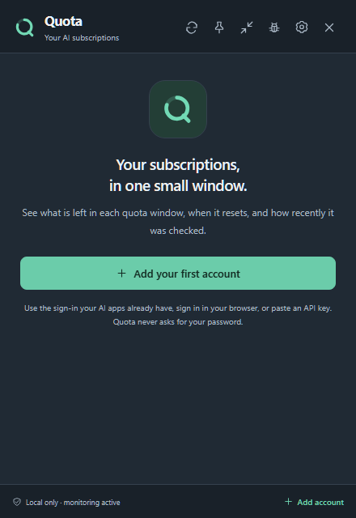

Quota opens as a small window above the tray icon: the **popover**. With no accounts yet,
it offers to add the first one.

Closing the window, with its close button or Alt+F4, hides it to the tray; Quota keeps
checking your accounts in the background. Click the tray icon to bring it back. Starting
Quota again while it runs brings the running window forward instead of opening a second
copy. Settings stays closed when Quota starts, even if it was open when you quit.

To start Quota when you sign in to your computer, turn on **Settings → General → Launch at
login**.

 

## Add an account

Choose **Add your first account**, **Add account** at the bottom of the popover, or **Add
account** in **Settings → Accounts**. The settings window opens on three steps: **Provider
→ Connect → Verify**.

### 1. Choose a provider

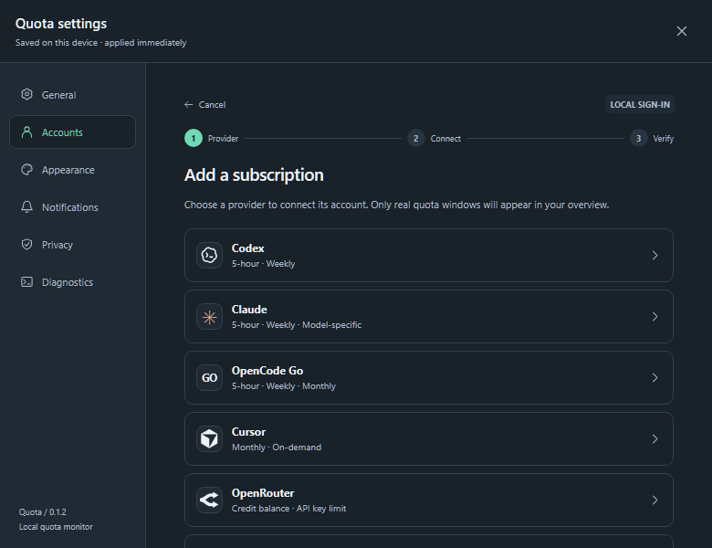

Each provider lists the allowance windows it reports. Quota signs in to a provider in one
of four ways:

| Provider             | How Quota signs in                                                                      | What to do first                                                                           | Windows                        |
| -------------------- | --------------------------------------------------------------------------------------- | ------------------------------------------------------------------------------------------ | ------------------------------ |
| Codex                | Reads the Codex CLI's existing sign-in                                                  | Run `codex login` in a terminal                                                            | 5-hour, weekly                 |
| Claude               | Reads Claude Code's existing sign-in                                                    | Run `claude` in a terminal and sign in                                                     | 5-hour, weekly, model-specific |
| Cursor               | Reads Cursor's existing sign-in                                                         | Sign in to the Cursor app                                                                  | Monthly, on-demand             |
| OpenCode Go          | API key, or the OpenCode CLI's sign-in                                                  | Create a key at opencode.ai/auth, or run `opencode auth login` and leave the key box empty | 5-hour, weekly, monthly        |
| OpenRouter           | API key                                                                                 | Create a key at openrouter.ai/settings/keys                                                | Credit balance, API key limit  |
| Z.ai GLM Coding Plan | API key                                                                                 | Create a key at z.ai/manage-apikey/apikey-list                                             | 5-hour, weekly, web tools      |
| MiniMax Coding Plan  | API key                                                                                 | Create a key at platform.minimax.io                                                        | 5-hour, weekly                 |
| Kimi for Coding      | API key, or the Kimi CLI's sign-in                                                      | Create a key at kimi.com/code/console, or run `kimi`, then `/login`                        | 5-hour, weekly, monthly        |
| Ollama Cloud         | API key, or the Ollama app's sign-in                                                    | Create a key at ollama.com/settings/keys, or run `ollama signin`                           | 5-hour, weekly, monthly        |
| Grok (SuperGrok)     | Browser sign-in to your xAI account, or the Grok CLI's                                  | Nothing: Quota opens the page. Or run `grok login` and use the CLI sign-in                 | Weekly, monthly, on-demand     |
| Muse Code            | Browser sign-in to your Meta account, or the Muse CLI's                                 | Nothing: Quota opens the page. Or run `muse login` and use the CLI sign-in                 | 5-hour, weekly                 |
| TypeSafe             | Website sign-in to console.typesafe.ai, in a separate Chrome or Edge window Quota opens | Nothing: sign in to the console in that window, Google included                            | Credit balance, credits        |

Quota never asks for your password. [Providers](providers.md) records exactly which file,
endpoint and fields each provider uses.

### 2. Connect

What Connect shows depends on how the provider signs in.

**An existing sign-in** (Codex, Claude, Cursor): Quota reads the sign-in the provider's
own tool already keeps on this computer. Nothing opens; press **Connect**.

**An API key**: paste the key into the masked box and press **Connect**. The key is kept
in your system's credential store (Windows Credential Manager, the macOS Keychain, or your
Linux keyring), never in Quota's own files. Where the provider's own tool can stand in for
a key, the box is optional.

**A browser sign-in** (Grok, Muse Code): Quota shows a code and opens the provider's page
in your browser. Approve the sign-in there, entering the code if the page asks for it.
Nothing comes back to the browser: Quota checks with the provider in the background and
moves on as soon as you approve. If the browser does not open within ten seconds, open the
address shown yourself; Quota keeps waiting.

**A website sign-in** (TypeSafe): TypeSafe shows its credit only on its website, so **Sign
in to TypeSafe** opens console.typesafe.ai in a separate Chrome or Edge window, just for
Quota. It uses a profile of Quota's own, so your usual tabs and sign-ins are not in it.
Sign in there as you usually do, with Google or otherwise, and close the window once the
console shows. While you sign in, Quota leaves that window alone, because the console's
Cloudflare check refuses a browser that anything is watching; once it is closed, Quota
reads the sign-in from it. Quota keeps that website session in your system's credential
store and reads only the billing page's credit. When the session ends, **Reconnect** opens
the same window again, usually signed in already; close it once the console shows. Without
Chrome or Edge, Quota opens a window of its own instead, where Google sign-in does not
work. If TypeSafe answers Quota with a bot check, the sign-in stops and says so: Quota
never tries to pass one.

<table>
  <tr>
    <td valign="top" width="50%">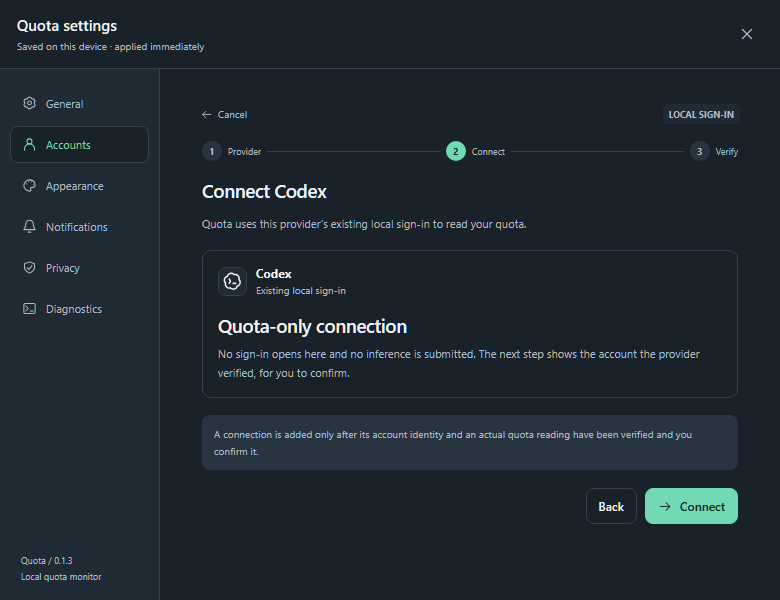 An existing sign-in</td>
    <td valign="top" width="50%">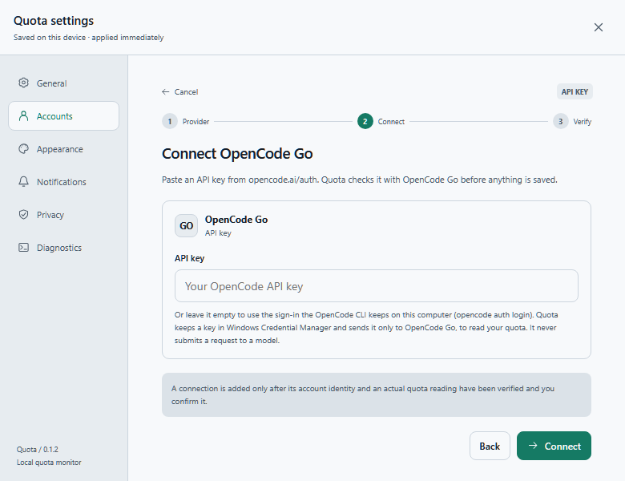 An API key</td>
  </tr>
  <tr>
    <td valign="top">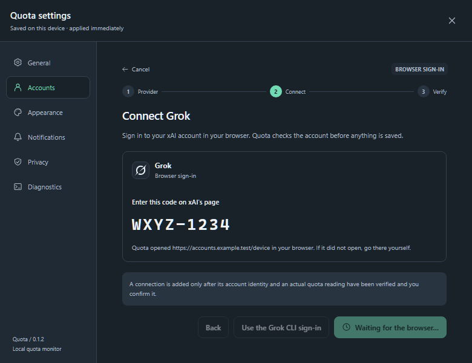 A browser sign-in</td>
    <td valign="top">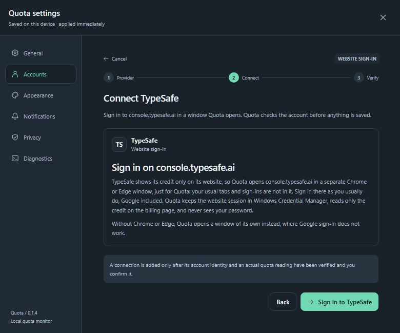 A website sign-in</td>
  </tr>
</table>

### 3. Verify

Quota shows the account the provider verified, its plan and its current readings. Nothing
is saved yet.

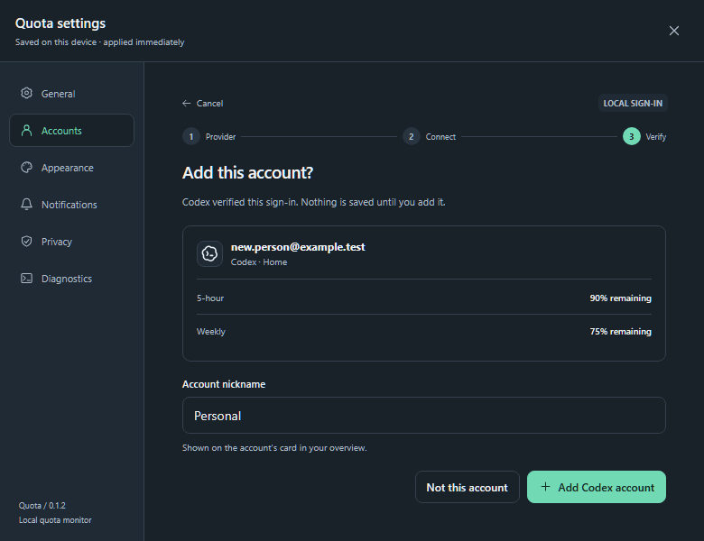

Give the account a nickname, the name its card shows, and choose **Add &lt;provider&gt;
account**. If it is the wrong account, choose **Not this account**: nothing is saved, and
Quota explains how to switch that provider to the account you meant. Cancel, leaving the
wizard, or quitting Quota also leaves nothing behind.

You can add several accounts of the same provider, for example a personal and a work
Claude, as long as each has its own sign-in or key.

## Read the overview

Each account is a card. A ring shows how much of a window is **left**, not how much is
used, with the time until it resets underneath. Cards are ordered closest to running out
first, by remaining allowance, and a card keeps its place while a new reading arrives.

<table>
  <tr>
    <td valign="top" width="33%">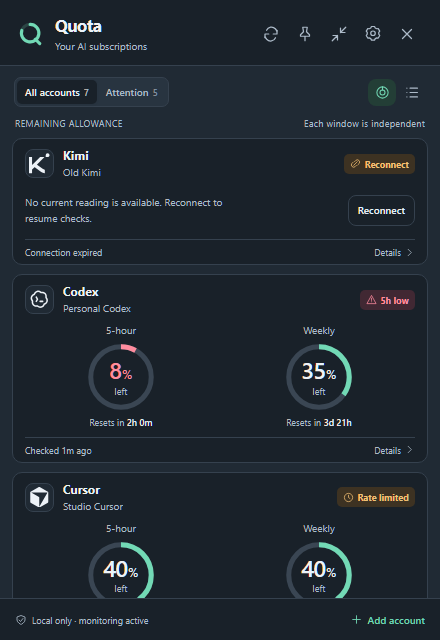 Rings, dark theme</td>
    <td valign="top" width="33%">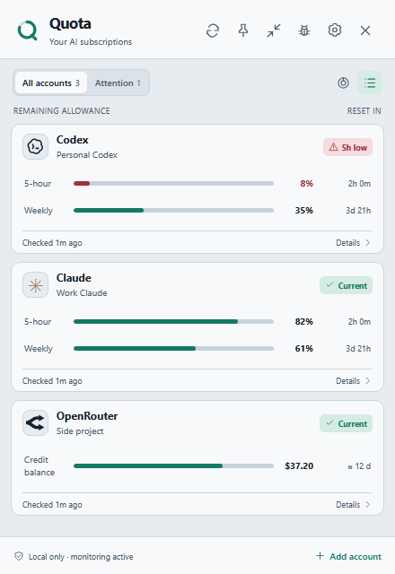 Compact bars, light theme</td>
    <td valign="top" width="33%">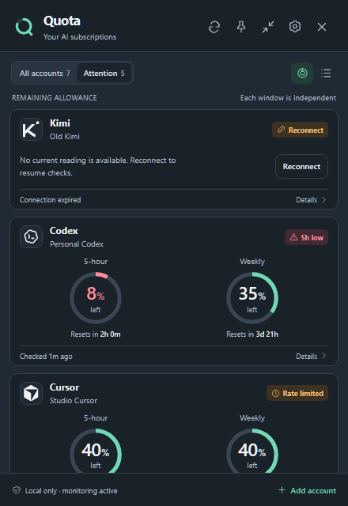 The Attention filter</td>
  </tr>
</table>

The header buttons, from left to right:

| Button                    | What it does                                                                                |
| ------------------------- | ------------------------------------------------------------------------------------------- |
| Refresh readings          | Asks for new readings, within each provider's minimum interval (see [Refresh](#refresh))    |
| Float / Dock              | Turns the popover into a floating window you can move by its header, and back               |
| Switch to the mini widget | Replaces the window with the [mini widget](#the-mini-widget)                                |
| Report a bug              | Opens a GitHub issue or copies a prompt for an AI agent (see [Report a bug](#report-a-bug)) |
| Settings                  | Opens the settings window                                                                   |
| Close                     | Hides Quota to the tray; checking continues                                                 |

**All accounts / Attention** filters the list. Attention shows only the accounts whose
badge is anything other than Current or Unlimited, such as a window at 20% or less, an
exhausted window, a failed check, a rate limit, or a sign-in to renew. Accounts with
monitoring off are left out.

The two buttons on the right switch between rings and a compact list of bars. Some
providers have more limits than the standard windows, such as Claude's model-specific
weekly allowance; those open under the card with **other limits**.

### Account status

The badge in each card's corner says how the account is doing:

| Badge                    | Meaning                                                                  | What to do                                                            |
| ------------------------ | ------------------------------------------------------------------------ | --------------------------------------------------------------------- |
| Current                  | Readings are fresh and every window has more than 20% left               | Nothing                                                               |
| &lt;window&gt; low       | A window has 20% or less left (red at 10% or less)                       | Slow down, or wait for the reset                                      |
| &lt;window&gt; exhausted | A window is used up                                                      | Wait for the reset shown under the ring                               |
| Unlimited                | The plan has no limit for this window                                    | Nothing                                                               |
| Rate limited             | The provider asked Quota to slow down; Quota waits before the next check | Nothing; it retries by itself                                         |
| Offline                  | The provider could not be reached                                        | Check your connection; it retries by itself                           |
| Check failed             | The provider answered with an error                                      | It retries; if it persists, see [Troubleshooting](troubleshooting.md) |
| Partially reported       | The provider left out some of the windows it normally reports            | Usually temporary                                                     |
| Stale                    | The last reading is old                                                  | Refresh, or check that monitoring is not paused                       |
| Reconnect                | The sign-in expired or was refused                                       | Choose **Reconnect** and sign in again                                |
| Monitoring off / Paused  | Checks are off for this account, or for all of them                      | Turn monitoring back on in Settings                                   |

<table>
  <tr>
    <td valign="top" width="50%">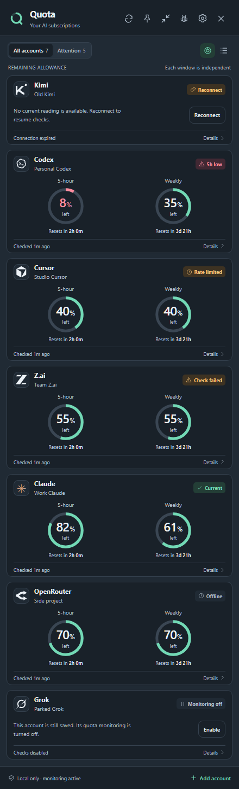 Most of the badges, one account each</td>
    <td valign="top" width="50%">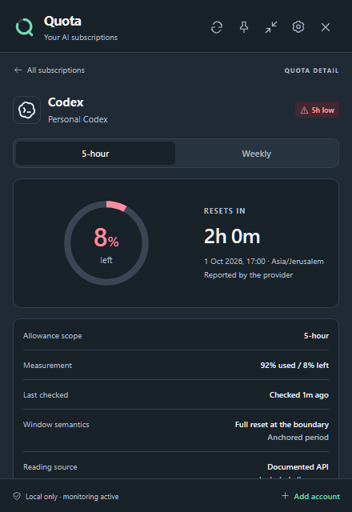 Quota detail for one window</td>
  </tr>
</table>

### Quota detail

Click a ring, or **Details**, for that account's detail: a tab for each window, when it
resets in your time zone, how much is used and left, when it was last checked, and where
the reading came from.

### Prepaid balances

OpenRouter is pay as you go: you load money, then spend it. Its card shows one ring, the
balance, measured from the last top-up Quota saw.

- The centre shows the money left, such as **$37.20**. The ring drains from the last
  top-up to zero and fills again when you load more.
- Under the ring: what the balance is measured from, such as **of $50.00 loaded on Sep
  28**, and how long it lasts at your recent pace, such as **≈ 12 days at $3.10/day**. The
  pace appears once Quota has a day of readings with some spending in it.
- Quota notices a top-up when the total OpenRouter reports as loaded goes up between two
  readings, and records exactly that amount. Until it has seen one, the balance is
  measured from when you added the account; after a refund, from the refund.
- The balance is low at 20% of the last top-up. Like any other window, it then turns the
  badge amber, counts for **Attention**, sends the notifications you chose, and moves the
  card up the closest-to-running-out order.
- The key you connected with may have its own spend limit. It is hidden until you turn on
  **Show this key's spend limit** for that account in **Settings → Accounts**: a key made
  only for Quota has a limit nobody needs to see. A key that cannot read the account
  balance always shows its limit, since that is its only reading.

The detail adds the share of the last top-up, what the key spent today, this week and this
month, the totals loaded and spent since the account opened, and every top-up Quota has
seen.

<table>
  <tr>
    <td valign="top" width="50%">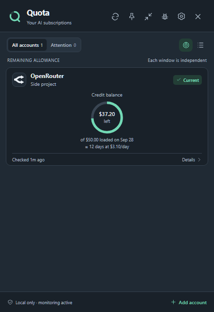 The balance on its card</td>
    <td valign="top" width="50%">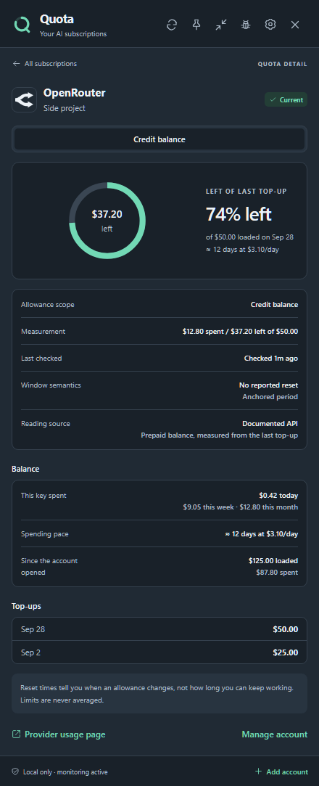 Its detail</td>
  </tr>
</table>

TypeSafe sells credit in grants, each with an amount and an expiry. Its balance is
measured from the grants still active, so the ring drains from their total, and the line
under it names the credit that expires first, such as **$4.20 expires Oct 31**. A new
grant is recorded as a top-up; an expired one leaves the gauge. The detail lists each
active credit with what is left of it and when it expires, and what you spent in the
current billing cycle.

<table>
  <tr>
    <td valign="top" width="50%">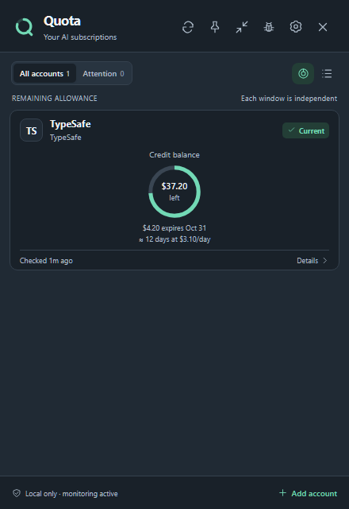 A TypeSafe balance on its card</td>
    <td valign="top" width="50%">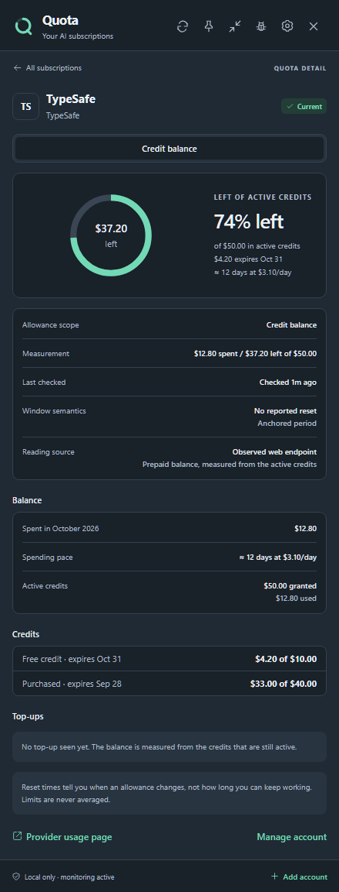 Its detail</td>
  </tr>
</table>

### Refresh

Quota checks each account by itself, as often as **Settings → General → Background
refresh** allows. Each provider also has a minimum interval, and a provider that asks
Quota to slow down is given more time; both win over the setting and over the refresh
button. When you press refresh and an account is not due yet, a message names the account
and when it can next be checked.

## The mini widget

The mini widget is a small window with every account at a glance. It replaces the full
window rather than opening beside it, stays on top of other windows, and keeps its place
and its view when Quota restarts. Drag it anywhere: press on a tile, a detail row, or the
frame, and move 4 px or more. If a screen is unplugged, or a screen's resolution or scale
changes, and the widget is left partly off the screens, it moves back just inside the
nearest one; it returns to its saved place when that screen layout does.

Switch to it with the header's **Switch to the mini widget** button, the tray menu's
**Mini widget**, or **Settings → General → Mini widget**. Its expand button, **Open the
full window**, switches back. Beside it, **Report a bug** offers the same two choices as
the header (see [Report a bug](#report-a-bug)). Both buttons show while the pointer is on
the widget.

In the rings layout, point at a tile and the line under the tiles names the account with
its status or next reset, without resizing the window or covering content. A click after
moving less than 4 px opens its details below the tiles, or above them when there is not
enough room below, such as near the taskbar. When space is limited on both sides, the
drawer's rows scroll. Click the tile again, its **Close the details** button, or another
app to close the drawer. Press Esc to close and return to the tile.

The overview layout picks the widget's look: rings give a strip of small rings, bars give
mini cards.

<table>
  <tr>
    <td valign="top" width="50%">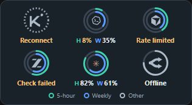 Rings: the ring strip</td>
    <td valign="top" width="50%">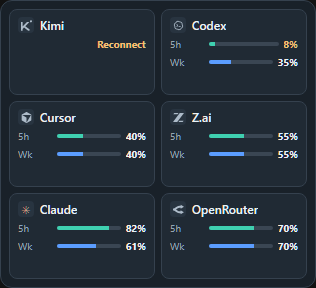 Bars: the mini cards</td>
  </tr>
</table>

## The tray icon

- **Left-click** opens Quota.
- **Right-click** opens the menu: **Settings**, **Show App**, **Mini widget** (a check
  mark shows which view is active), **Report a bug** (see [Report a bug](#report-a-bug)),
  and **Exit**.

**Exit** is the only way to stop Quota; closing a window hides it to the tray.

## Report a bug

**Report a bug** is in the tray menu, behind the bug button in the header, beside the mini
widget's **Open the full window**, and in **Settings → Diagnostics**. Each offers two
choices:

- **Open an issue on GitHub** opens Quota's bug form in your browser with your Quota
  version, operating system, view and connected providers already filled in. You describe
  what happened; you need a GitHub account to submit it.
- **Copy a prompt for an AI agent** copies a prompt to paste into an AI coding agent, such
  as Claude Code. The agent asks you what happened, shows you the issue for approval, and
  files it with the GitHub CLI. A message confirms the copy; from the tray it is a system
  notification.

Neither includes account names, email addresses, keys or file paths: only the version, the
operating system, the view and the provider names, such as `claude` or `codex`.

<table>
  <tr>
    <td valign="top" width="58%">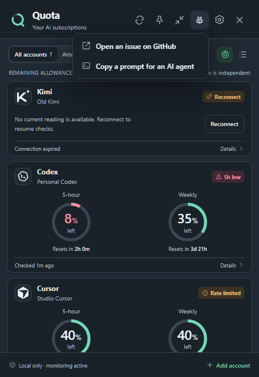 From the header</td>
    <td valign="top" width="42%">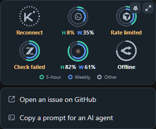 From the mini widget</td>
  </tr>
</table>

## Manage accounts

**Settings → Accounts** lists every account.

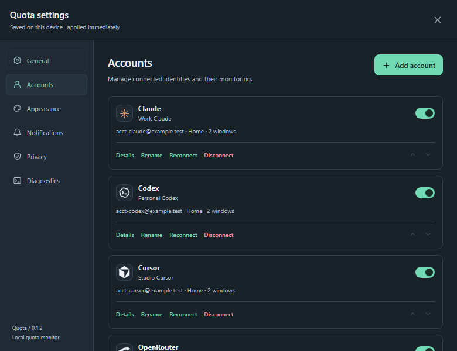

- The switch turns checking on or off for that account. Its last readings stay visible.
- **Details** opens the account's quota detail.
- **Rename** changes its nickname.
- **Reconnect** checks the sign-in again right away, even while monitoring is paused. Use
  it after you sign in again in the provider's own tool.
- **Disconnect** removes the account from Quota and deletes any key Quota kept for it from
  the credential store. It does not sign you out of the provider's own apps.
- The arrows move the account up or down in this list.
- For an OpenRouter account, **Show this key's spend limit** adds the key's own limit to
  its card. It is off by default; see [Prepaid balances](#prepaid-balances).
- For OpenRouter and OpenCode Go, **Account group** puts several keys of one provider
  account together; see [Several keys of one account](#several-keys-of-one-account).

 

### Several keys of one account

OpenRouter and OpenCode Go let one account hold several API keys, such as one for you, one
for CI and one for an agent. Each key is added as its own account and put in a group, the
provider account it belongs to:

- **While adding a key:** on the wizard's last step, **Account group** puts the key in an
  existing group, or in a **New group…** you name, for example **Work**.
- **From the group:** **Add key** on the group's card, or beside its name in **Settings →
  Accounts**, opens the wizard with that group already chosen.
- **For keys you already have:** in **Settings → Accounts**, open **Account group** on a
  key and choose the group, or **New group…**.

<table>
  <tr>
    <td valign="top" width="50%">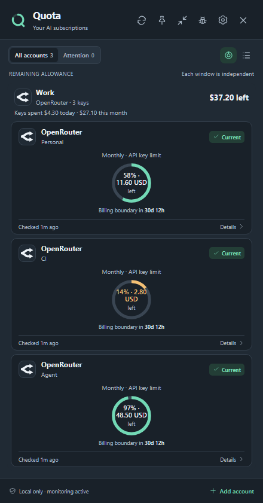 One account, three keys</td>
    <td valign="top" width="50%">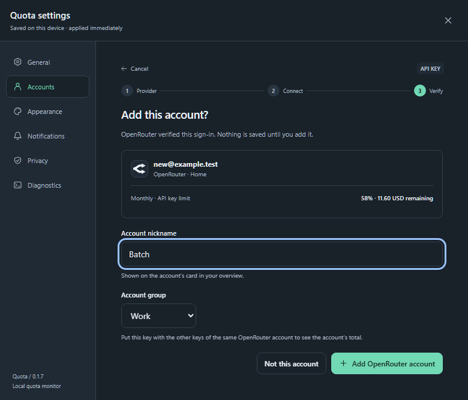 Adding a key to a group</td>
  </tr>
</table>

The overview then shows the account as one card:

- **The account** is the ring at the top: the balance, and what its keys spent together
  today, this week and this month. Every key reads the same balance, so it is shown once,
  never added up.
- **Each key** has its own smaller ring under it: what is left of its spend limit, with
  the money left under the ring. Select a key's ring to open that key's details. A key
  that stops working shows it on its own ring, the card's badge names it, and the other
  keys carry on.
- The mini widget shows a tile for the account's balance, then a tile for each key with
  the key's name inside its ring.

You choose what the group shows. On each grouped key in **Settings → Accounts**:

- **Show this key in …** off leaves the key's ring out of the overview and the widget, for
  a key you don't need to watch. The card then says how many keys are hidden. The key
  still counts in the account's total, because the money is the account's.
- **Show what the keys spent** off leaves out the "Keys spent" line. It applies to the
  whole group, so it reads the same on every key of the group.

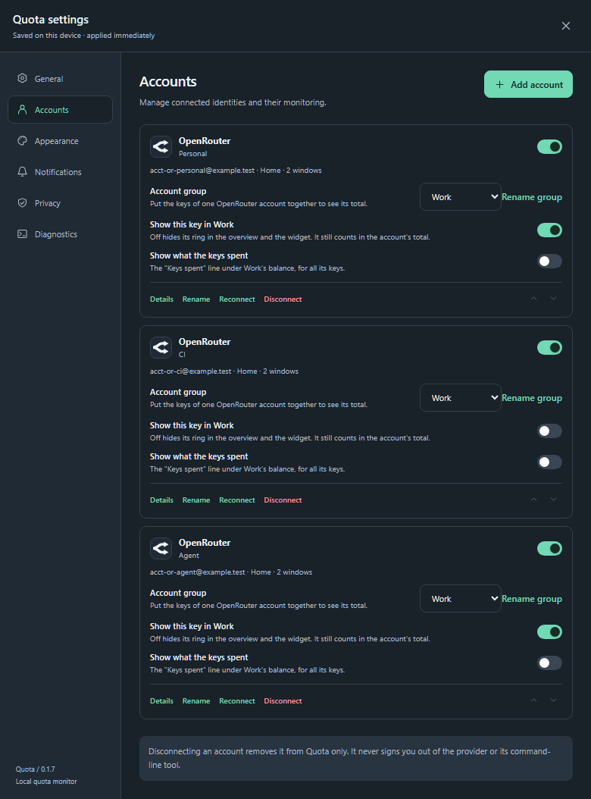

OpenCode Go reports usage for the whole subscription, not per key, so its group shows the
5-hour, weekly and monthly usage once at the top, and each key's ring shows only whether
that key is working.

The provider does not say which account a key belongs to, so Quota cannot check it: put
only keys of the same account in one group. Choosing **Not grouped** takes a key out; a
group with no key left is removed. **Hide account names** shows groups as "Group 1",
"Group 2".

## Settings

Open Settings from the header's gear button or the tray menu. Every change is saved on
this computer and applies immediately.

<table>
  <tr>
    <td valign="top" width="33%">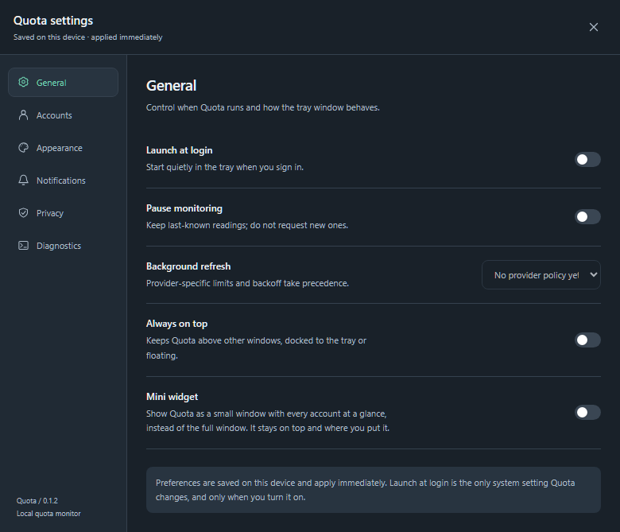 General</td>
    <td valign="top" width="33%">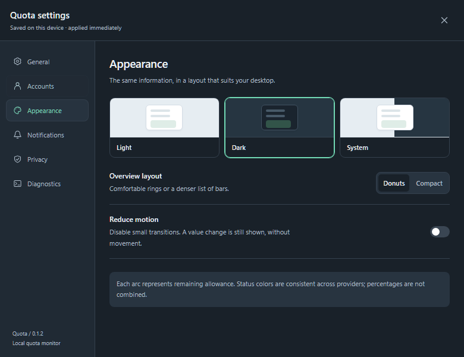 Appearance</td>
    <td valign="top" width="33%">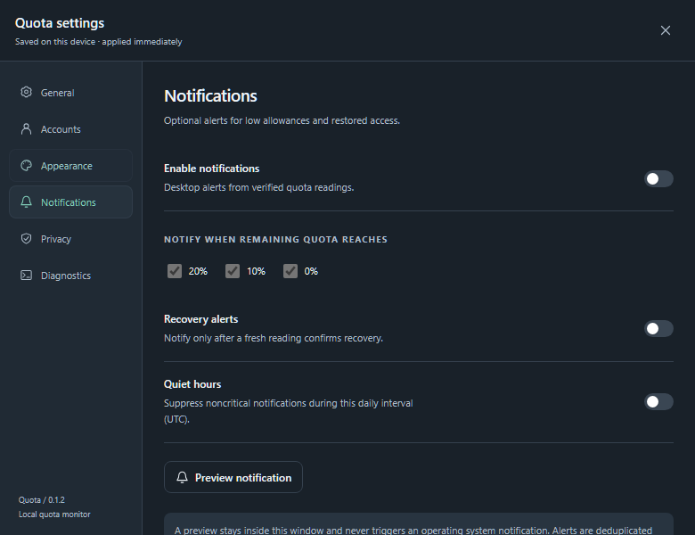 Notifications</td>
  </tr>
  <tr>
    <td valign="top" width="33%">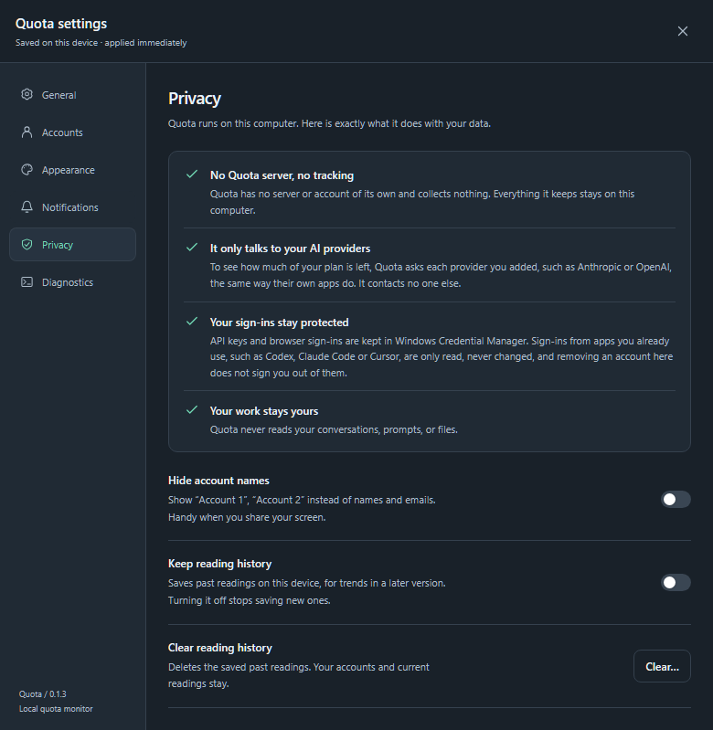 Privacy</td>
    <td valign="top" width="33%">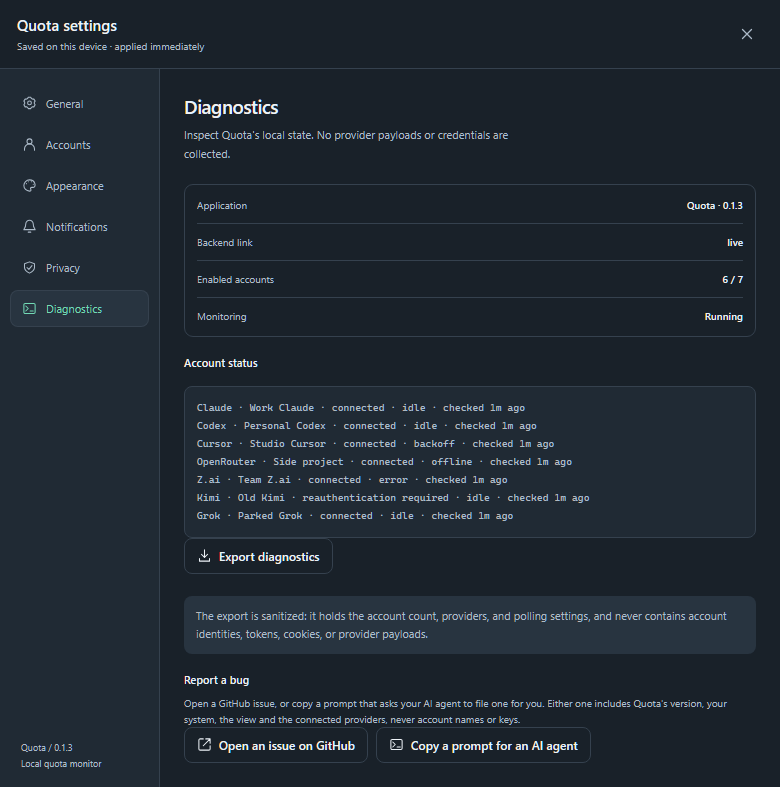 Diagnostics</td>
    <td valign="top" width="33%"> Accounts</td>
  </tr>
</table>

### General

| Setting            | What it does                                                                                                       |
| ------------------ | ------------------------------------------------------------------------------------------------------------------ |
| Launch at login    | Starts Quota quietly in the tray when you sign in to your computer                                                 |
| Pause monitoring   | Keeps the last readings and stops asking providers for new ones                                                    |
| Background refresh | How often Quota checks: every minute, 5 minutes or 15 minutes. Provider minimums and slow-down requests come first |
| Always on top      | Keeps the full window above other windows, docked or floating. The mini widget is always on top                    |
| Mini widget        | Shows the [mini widget](#the-mini-widget) instead of the full window                                               |

### Appearance

- **Theme**: Light, Dark, or System, which follows your operating system.
- **Overview layout**: **Donuts** (rings) or **Compact** (bars). This also picks the mini
  widget's look.
- **Reduce motion**: turns off small transitions; values still change, without movement.

### Notifications

- **Enable notifications**: desktop alerts based on verified readings. Off by default.
- **Notify when remaining quota reaches**: 20%, 10% and 0%; choose any of them.
- **Recovery alerts**: tells you when a window is available again, once a fresh reading
  confirms it.
- **Quiet hours**: holds back non-critical notifications during a daily interval. The
  times are in UTC.
- **Preview notification** shows what an alert looks like inside the window, without
  sending a real one.

Alerts are not repeated within the same quota window.

### Privacy

The panel states what Quota does with your data; [Your data](#your-data) below has the
details. Its settings:

- **Hide account names** shows "Account 1", "Account 2" instead of names, emails and
  workspaces everywhere, including the add-account wizard. Use it when you share your
  screen or take screenshots.
- **Keep reading history** saves past readings on this computer for future trend views.
  Turning it off stops saving new ones.
- **Clear reading history** deletes saved past readings; accounts and current readings
  stay.

### Diagnostics

Diagnostics shows Quota's version, whether the window is connected to the background
service, how many accounts are checked, and each account's last status.

**Export diagnostics** writes `quota-diagnostics-settings.json` to the `diagnostics`
folder in [Quota's data folder](#where-quota-keeps-its-data) and shows the full path. It
contains the account count, provider names and polling settings, and no account names,
credentials, file paths or provider answers. Exporting again replaces the file.

**Report a bug** at the bottom of the panel offers the same two choices as the header (see
[Report a bug](#report-a-bug)).

## Updates

Installed copies check for a published update when they start and while they run in the
tray. The next check is due 30 minutes after the previous one ends, including any time
spent in the pop-up, and checks pause while an offer, an installation, or a failure
message is open.

A newer version opens one pop-up in Quota's theme, naming the available and current
versions.

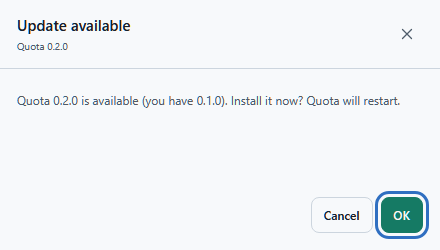

**OK** downloads the matching package, verifies its signature, installs it and restarts
Quota. **Cancel**, or closing the pop-up, keeps the current version. A declined version or
a failed installation is not offered again until Quota restarts; a newer version can be
offered at the next check.

A failed check stays silent and logs a warning, and every check and download has a time
limit. A failed installation shows a message with **Close**, and Quota keeps running its
current version. Development, debug, sample-data and inspection builds never check. There
are no update settings, channels, release notes or progress bar.

 

Each copy updates with the kind of package it was installed from: the Windows installer or
MSI, the AppImage, the `.deb` or `.rpm`, or the Mac app. To replace an AppImage by hand,
follow [Replacing an AppImage by hand](RELEASING.md#replacing-an-appimage-by-hand).

## Your data

Quota has no server and no account of its own, and collects nothing.

- **What it contacts**: only the providers you add, to read your remaining allowance, the
  same way their own apps do; and GitHub, to check for updates.
- **What it reads**: the sign-in files of Codex, Claude Code, Cursor and the provider CLIs
  you choose to use, read-only. It never changes or refreshes them, and disconnecting an
  account does not sign you out of those tools.
- **What it never reads**: your conversations, prompts or files.
- **Where secrets go**: API keys and browser sign-ins are kept in your system's credential
  store (Windows Credential Manager, the macOS Keychain, or your Linux keyring).

### Where Quota keeps its data

| What                                | Windows                                    | Linux                                           | macOS                                                          |
| ----------------------------------- | ------------------------------------------ | ----------------------------------------------- | -------------------------------------------------------------- |
| Accounts, readings and settings     | `%APPDATA%\app.quota.monitor\`             | `~/.config/app.quota.monitor/`                  | `~/Library/Application Support/app.quota.monitor/`             |
| Diagnostics export (`diagnostics\`) | `%APPDATA%\app.quota.monitor\diagnostics\` | `~/.local/share/app.quota.monitor/diagnostics/` | `~/Library/Application Support/app.quota.monitor/diagnostics/` |
| Log (`quota.log`)                   | `%LOCALAPPDATA%\app.quota.monitor\logs\`   | `~/.local/share/app.quota.monitor/logs/`        | `~/Library/Logs/app.quota.monitor/`                            |

The log records warnings and failures, never keys, tokens, sign-in codes or provider
answers. Error messages that refer to the log give its full path.

## Uninstall

1. In **Settings → Accounts**, **Disconnect** each account you added with an API key or a
   browser sign-in, so Quota deletes those keys from the credential store.
2. Turn off **Settings → General → Launch at login**.
3. Choose **Exit** in the tray menu.
4. Uninstall the app: on Windows, **Settings → Apps → Installed apps → Quota →
   Uninstall**; on macOS, move Quota from Applications to the Bin; on Linux, delete the
   AppImage, or remove the `.deb` or `.rpm` package with your package manager.
5. To remove everything Quota saved, delete the folders in
   [Where Quota keeps its data](#where-quota-keeps-its-data).
